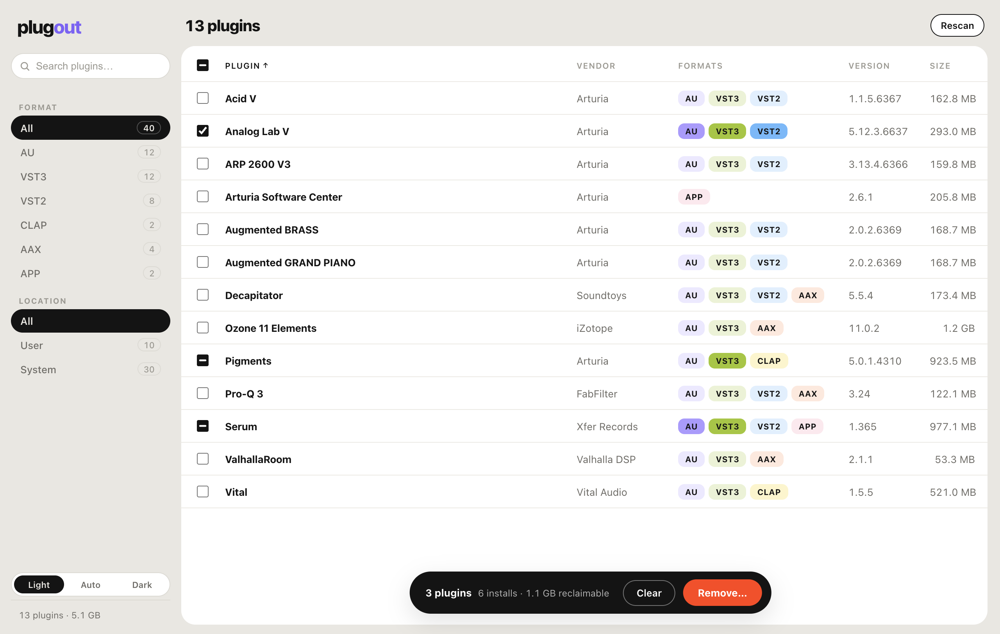

# plugout

**Find and remove audio plugins on macOS.** AU, VST3, VST2, CLAP, AAX.

<br>

<picture>
  <source media="(prefers-color-scheme: dark)" srcset="docs/screenshot-dark.png">
  
</picture>

## Why

Every plugin installer drops three or four copies of the same thing — a `.component`
here, a `.vst3` there, a VST2 and an AAX build you never asked for. Ten years of
producing later, your plugin folders hold hundreds of bundles, your DAW scans them all
at every launch, and nobody remembers which ones are still in use. Vendors ship
uninstallers inconsistently or not at all.

plugout scans all of it, shows one row per plugin instead of one per file, and lets you
throw out whole plugins or individual formats. Nothing is deleted — everything goes to
the Trash, so any mistake is a drag-and-drop away from undone.

## What it does

- Scans the user (`~/Library`) and system (`/Library`) plugin folders for all five
  formats, streaming results as they're found — no waiting for a full scan.
- Merges every plugin's format bundles into a single row. Select the whole plugin with
  the checkbox, or click individual format chips to remove just the VST2, say, and keep
  the rest.
- Shows real versions. Audio Units report an integer build number (`65797`); plugout
  displays the human version from the plugin's other formats instead.
- **Companion apps are a format too.** The standalone app a plugin installed in
  `/Applications` shows up as an `APP` chip on the plugin's row, matched by name,
  bundle-id vendor, or vendor folder; vendor tools like license managers get their
  own row. Remove them like any format — or keep them.
- **Support files go too, safely.** Removal offers the presets, preferences and caches
  the plugin's installer wrote — only with receipt proof, only when no surviving plugin
  shares the installer, only under safe Library roots, and always visibly toggleable
  in the confirmation.
- The inspector header identifies the plugin — Instrument / Effect / MIDI Effect (from
  the AU component type) and copyright, read straight from the bundle. Below it, each
  install's version, size, location, bundle ID, which macOS installer package placed it
  (`pkgutil` receipt), and exactly which files a removal will touch. One click to reveal
  any bundle in Finder.
- Sortable columns — name, vendor, format count, version (numeric-aware), size.
- **Removal moves bundles to the Trash**, never deletes. User-scope plugins need no
  privileges; system-scope removals ask for an administrator password once per batch,
  not once per plugin.
- Light and dark theme, or auto-follow the system appearance.

## Install

Grab the latest DMG from [Releases](../../releases), open it, drag plugout to
Applications.

The app is not code-signed yet, so the first launch needs one of:

```sh
xattr -cr /Applications/plugout.app
```

or right-click the app → Open → Open.

**Updates are automatic** from then on: the app checks this repo's releases at
launch, and when a new version exists a pill appears in the toolbar — one click
downloads it, one more restarts into the new version. Updates are signed and
verified against a key embedded in the app.

## How it works

The backend is Rust. A scan walks `Components`, `VST`, `VST3`, `CLAP` under both
`Library/Audio/Plug-Ins` roots plus the Avid AAX directory, reads each bundle's
`Info.plist` for name, vendor, version, bundle ID, category (the AU component type)
and copyright, then walks the Applications folders for companion apps linked to those
plugins — all streamed to the UI over
Tauri events within the first seconds. Installer receipts are linked afterwards in
the background (`pkgutil --file-info` is slow, so it never blocks the list; a
"linking installers…" indicator shows while it runs). When you remove something,
`pkgutil --files` over the plugins' receipt families reveals the installers' support
files, guarded so nothing shared with surviving plugins is ever offered. Removal
uses the macOS Trash API for user files and a single `with administrator privileges`
shell call for the whole system-scope batch.

The frontend is React. Format bundles are merged into plugins client-side
(`mergePlugins` in [src/util.ts](src/util.ts)), selection is tracked per bundle so
per-format removal falls out of the data model, and the whole UI runs against a mock
backend in a plain browser for development.

## Development

```sh
npm install
npm run tauri dev     # the real app
npm run dev           # frontend only, in a browser, with a mock backend
```

Tests:

```sh
npm test              # frontend: merging, sorting, components
cd src-tauri && cargo test   # backend: scanner, receipts, remover
```

## Releasing

Bump `version` in [src-tauri/Cargo.toml](src-tauri/Cargo.toml) and push to `main`.
CI notices the version has no tag yet, builds a universal (Intel + Apple Silicon) DMG,
tags `v<version>`, and publishes a GitHub release with the DMG attached. Pushes that
don't change the version do nothing.

## Scope

plugout removes plugin bundles, their companion applications, and — with installer
receipts as proof — the support files those installers wrote. Files that can't be
tied to an installer, or whose installer is shared with plugins staying on the
machine, are deliberately left alone. Everything goes through the Trash.

## License

[Apache-2.0](LICENSE)
